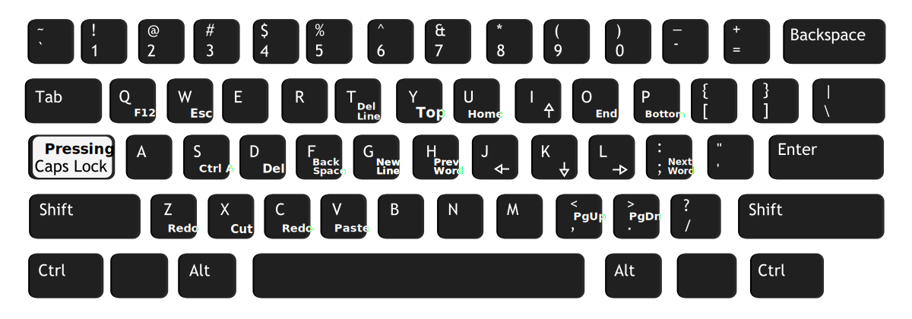

English | [中文](README_zh-CN.md)

---

## How to run the source code?
1. Download and install [AutoHotkey (v1.1.+)](http://www.ahkscript.org/)
2. Run `Capslock+.ahk`

## Current Layout

## How to set a custom function to a hotkey?
1. There is a key function `keyFunc_example2` in demo.ahk.
2. Add below setting under the [Keys] section in `CapsLock+settings.ini`:
    `caps_f7=keyFunc_example2`
3. Save, reload Capslock+ (CapsLock+F5)
4. Press `CapsLock+F7` to invoke the function
    * In order to avoid calling the internal functions, all the key functions are restricted to start with `keyfunc_`

## How to modify the original functions?
`CapsLock+.ahk` is the entry file, library files are in the `/lib` folder,
the function of each file is as follows:

|Filename|Description|
|:---|:---|
|lib_bindWins.ahk|Window binding|
|lib_clQ.ahk|qbar|
|lib_clTab.ahk|CapsLock+Tab|
|lib_functions.ahk|Some utils|
|lib_init.ahk|Program initialization|
|lib_jsEval.ahk|The calculation function implemented by using the IE engine, required by Math Board and CapsLock+Tab|
|lib_json.ahk|json library|
|lib_keysFunction.ahk|All the key functions|
|lib_keysSet.ahk|Hotkey layouts|
|lib_loadAnimation.ahk|Loading animation when the program starts|
|lib_mathBoard.ahk|Math Board|
|lib_mouseSpeed.ahk|Mouse speed modification|
|lib_settings.ahk|Load the settings in CapsLock+settings.ini|
|lib_ydTrans.ahk|Youdao Translation|

